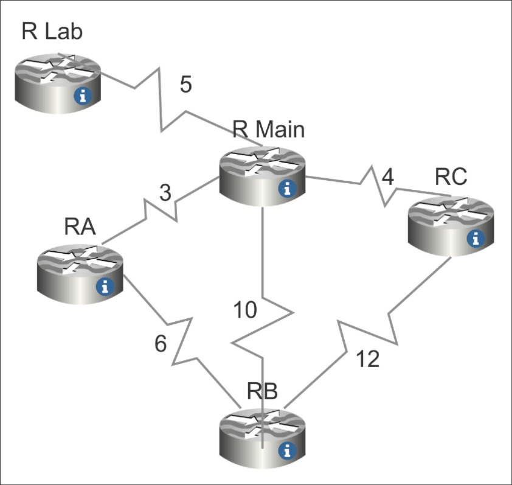

# Dijkstra vs Bellman-Ford Comparison in Routing

This repo was made for an assignment of the course "Algorithm Design and Analysis".

We are asked to solve a problem with an algorithm and analyze its complexity. I chose to compare Dijkstra and Bellman-Ford algorithm with the problem of network routing since I took the "Computer Networks" course in the same semester.

Here's the graph topology of the routing problem:

